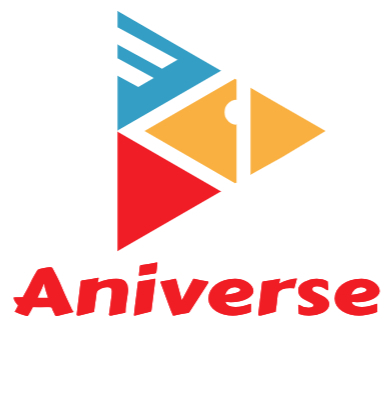

<<<<<<< HEAD
# Project-2
=======
>>>>>>> 8264732ac79a3f6392d7dbca376d58b7a852e9d9
# Aniverse  
   
## Description
    An App where you can interact with other anime lovers. The love of anime in which aniverse Users will bring them closer together. A App where you can Post about your favorite animes you love, cherish, and also gain a sense of intreset for other animes becasuse of othere peoples intresets.
Deployed link['https://github.com/MarcusC811/Aniverse/tree/main']
## Table of Contents
* [Installation](#installation)
* [Usage](#usage)
* [Contribution](#contribution)
* [Tests](#tests)
* [Credits](#credits)
* [License](#license)
* [Questions](#questions)
## Installation
Go to the command line and install npm start and Run nmp seed . Downlowand mysql Install and also install insomnia so that you can open browsers and go to the port 3001 unsing insomnia .
 ## Usage
You can access and use the app through loging in or signing up for a profile. you can then interact in varies ways through the application with the help of our navigation bar/Links. Then Users can find new found passions for animes that they were never aware of through other users posts.

## Contribution
For any future improved developments or bugs please message us at me and my peers emails .
## Tests
There where no tests in this project. 
## Credits
Credit goes to Marcus carlough,amanda Lopez,Mohamed abdulkadir,Julian Loug,Nasir Abdulakdir
## License
[MIT License](https://choosealicense.com/licenses/mit/)

## Questions
If you have questions, please reach out via email or my GitHub account.
* GitHub: [nasiromar](https://github.com/nasiromar)
* E-mail: [nasiromar321@gmail.com](mailto:nasiromar321@gmail.com)
* GitHub: [MarcusC811](https://github.com/MarcusC811)
* E-mail: [marcuscarlough@gmail.com](mailto:marcuscarlough@gmail.com)
* GitHub: [scorpio1028](https://github.com/scorpio1028)
* Email:  [blanca.lopez83@gmail.com](mailto:blanca.lopez83@gmail.com)
* GitHub: [Abdul2k24](https://github.com/abdi2k24@gmail.com)
* Email:  [abdi2k24@gmail.com](mailto:abdi2k24@gmail.com)
* GitHub: [vivid20221](https://github.com/vivid20221) 
<<<<<<< HEAD
* Email:  [julianj9011@gmail.com](mailto:julianj9011@gmail.com)
                                                                     

    
=======
* Email:  [julianj9011@gmail.com](mailto:julianj9011@gmail.com)]
>>>>>>> 8264732ac79a3f6392d7dbca376d58b7a852e9d9
